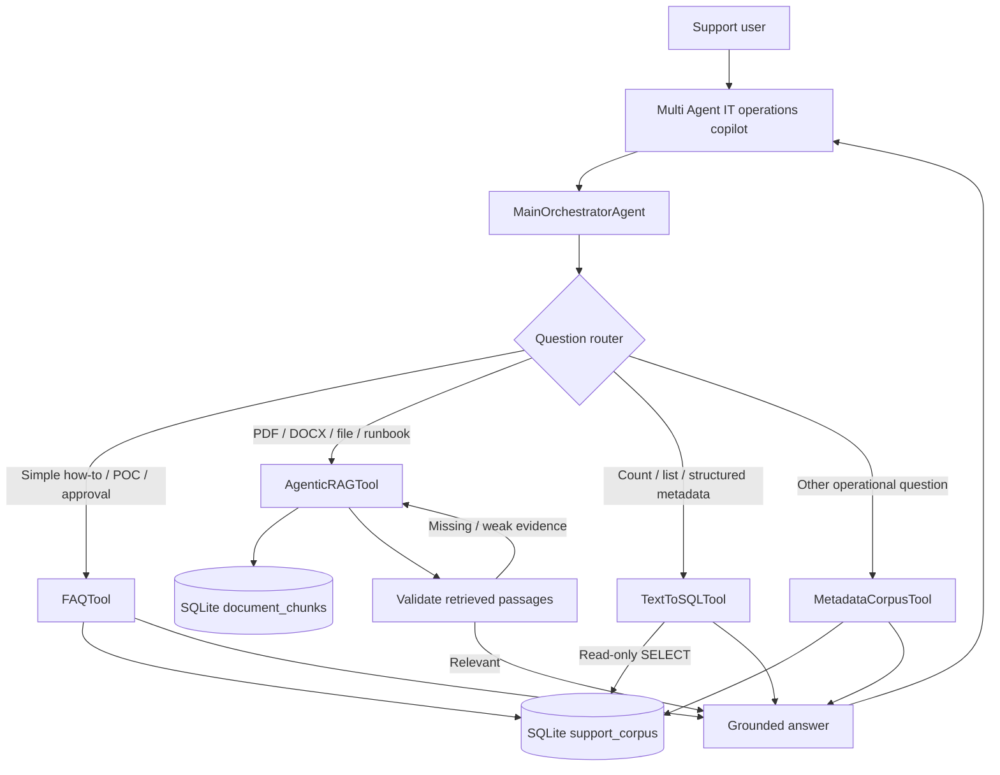
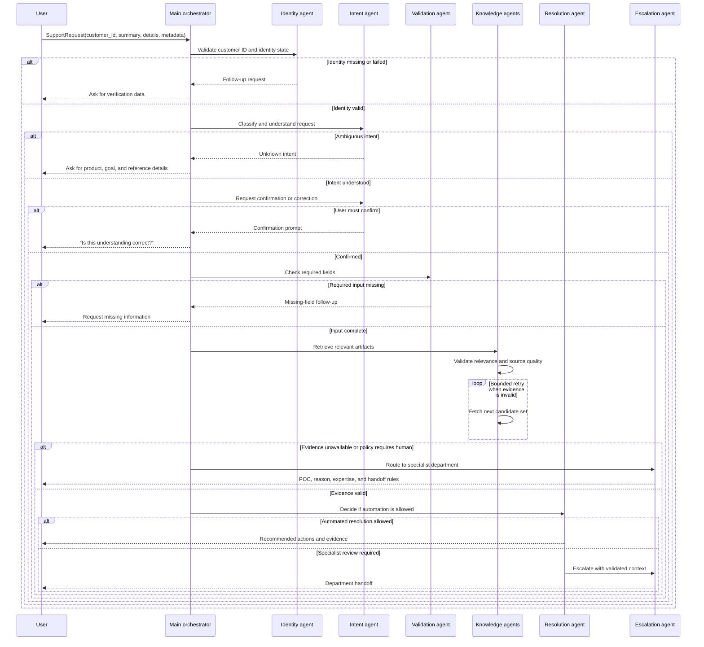

# Multi-Agent IT Operations Support Platform

An enterprise IT operations copilot for banking-style support teams. Users can ask how to resolve an issue, raise a CMP request, find a POC, obtain an approval, install approved software, query indexed runbooks, or submit a structured support request.

The implementation uses **LangGraph for specialist agent workflows**, SQLite for the local metadata corpus, optional OpenAI models for grounded language responses, and Streamlit for the test UI.

## Architecture

The Streamlit interface sends each operational question to `MainOrchestratorAgent.answer_question()`. The orchestrator selects the smallest suitable tool and returns a grounded `ToolAnswer` containing the answer, selected tool, sources, corpus records, or document chunks.



### Tool-selection policy

| User query shape | Tool | Data source |
| --- | --- | --- |
| “How do I activate SafeWord?”, “Who approves access?”, “How do I raise CMP?” | `FAQTool` | Maintained `FAQ-*` records in SQLite |
| “What does the access runbook/PDF say?” | `AgenticRAGTool` | Indexed PDF, DOCX, TXT, Markdown, CSV, or JSON chunks |
| “List all certificate records”, “How many access records?” | `TextToSQLTool` | Allow-listed, read-only SQL over SQLite metadata |
| General issue resolution, installation, routing, or fallback questions | `MetadataCorpusTool` | SOP and operational metadata records |

The router tries the simple FAQ path first, then document RAG, then structured SQL, and finally broad metadata retrieval. A question is not sent to every tool by default; the intent of the query controls the path.

## End-to-end support workflow

Structured support requests use `MainOrchestratorAgent.process_request()` and the specialist subagents below.



## LangGraph agents

Each specialist folder contains an `agent.py` graph implementation and a `prompt.py` prompt contract. The prompts are used by the optional OpenAI-backed paths; deterministic rules remain available for local execution and tests.

```text
src/support_platform/
  agent.py                 Main orchestrator and routing policy
  models.py                Shared dataclasses and state contracts
  corpus.py                SQLite corpus, SOP/FAQ loading, ranking, grounded answers
  tools.py                 FAQ, metadata, agentic RAG, and read-only SQL tools
  document_qa.py           Document extraction, chunking, and document store
  database.py              Knowledge artifact repository
  llm.py                   Optional OpenAI adapter
  utils.py                 Shared flag and request helpers
  subagents/
	identity/              Customer identity validation
	intent/                Intent classification and confirmation
	validation/            Required-field validation and follow-up questions
	knowledge/              Retrieval and retrieved-evidence validation
	resolution/            Automated-resolution decision
	escalation/            Human department routing
```

The root [support_platform.py](support_platform.py) is a compatibility import for existing callers. New code should import from `src.support_platform`.

## Data and grounding

The local corpus has two maintained inputs:

- [data/operations_sop_faq.json](data/operations_sop_faq.json): SOP/FAQ records with category, keywords, answer, procedure, POC, approval, and source metadata.
- `DEFAULT_CORPUS` in [src/support_platform/corpus.py](src/support_platform/corpus.py): baseline operational records used by tests and local development.

`CorpusRepository.seed()` loads both into the `support_corpus` SQLite table. `CorpusRepository.search()` ranks title and keyword matches above broad answer-text matches. FAQ answers return only the best relevant FAQ record; broader tools can return multiple records.

Document RAG stores extracted chunks in `document_chunks`. It supports PDF, DOCX, TXT, Markdown, CSV, and JSON. The UI does not require uploads for operational QA; document ingestion is available when a runbook or file-specific answer is needed.

## OpenAI configuration

OpenAI is optional. Without credentials, the system uses deterministic retrieval and extractive answers. To enable prompt-based grounded responses:

```powershell
$env:SUPPORT_PLATFORM_LLM_ENABLED = "true"
$env:OPENAI_API_KEY = "your-key"
$env:OPENAI_MODEL = "gpt-4o-mini"
```

Do not commit API keys. In production, use a secret manager and replace placeholder POCs and source links with approved institution-owned metadata.

## Run locally

Install dependencies:

```powershell
pip install -r requirements.txt
```

Run the Streamlit app:

```powershell
streamlit run app.py
```

Use a persistent local corpus database when needed:

```powershell
$env:SUPPORT_PLATFORM_CORPUS_DATABASE = "data/support_corpus.db"
streamlit run app.py
```

## Test and validate

```powershell
python -m unittest discover -s tests -v
python -m py_compile app.py src/support_platform/*.py
```

The test suite covers identity validation, intent confirmation, missing input, retrieval retry, SQLite persistence, cross-thread Streamlit access, FAQ routing, agentic RAG routing, read-only SQL enforcement, SOP/FAQ loading, and escalation.

## Production integration boundaries

The repository is a working local reference implementation. Production deployment should replace or extend these boundaries:

- `CorpusRepository` with the approved knowledge API or enterprise database.
- Placeholder POCs and `kb://` / `faq://` sources with governed service-catalog records.
- Local SQLite with a managed database and connection pooling.
- Optional OpenAI adapter with the organization’s approved Azure OpenAI/OpenAI gateway.
- Streamlit session access with enterprise authentication and authorization.
- Deterministic keyword routing with an evaluated intent classifier when query volume and ambiguity require it.

The system should never expose secrets, token seeds, OTP values, private keys, or unapproved operational instructions in answers or ticket evidence.
